# Digital-VR

VR에서 전가산기(Full Adder)를 배우는 학습 앱입니다. 입력값을 정리하고 진리표와 카르노맵을 완성한 뒤, 게이트와 배선을 직접 구성해 최종 논리식을 확인합니다.

이 저장소는 Windows 실행 파일 ver1~ver4와 사용 안내를 제공합니다.

## 다운로드 및 실행

**[최신 버전 ver4 다운로드](Releases/Windows/ver4/DigitalVR2-Windows.zip)**

1. ZIP을 다운로드하고 전체 압축을 해제합니다.
2. OpenXR 지원 VR HMD와 컨트롤러를 연결합니다.
3. 압축 해제 폴더에서 `DigitalVR2.exe`를 실행합니다. 함께 들어 있는 데이터 폴더와 DLL 파일도 유지해야 합니다.

Unity Editor 설치 없이 실행할 수 있습니다.

## 학습 가이드 — ver4

아래 사진은 실제 VR 플레이 녹화 영상에서 추출한 화면입니다. 입력값과 회로 상태는 학습 진행에 따라 달라집니다.

### 시작 안내

학습 목표, 전체 학습 순서, 조작 방법을 확인합니다. `NEXT`로 안내를 넘기고 마지막 화면에서 `START`를 선택합니다. 왼손 그립으로 UI 위치를 조정할 수 있습니다.

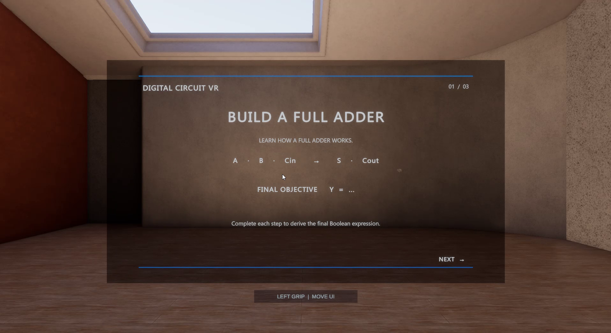

학습 순서와 조작 안내 보기

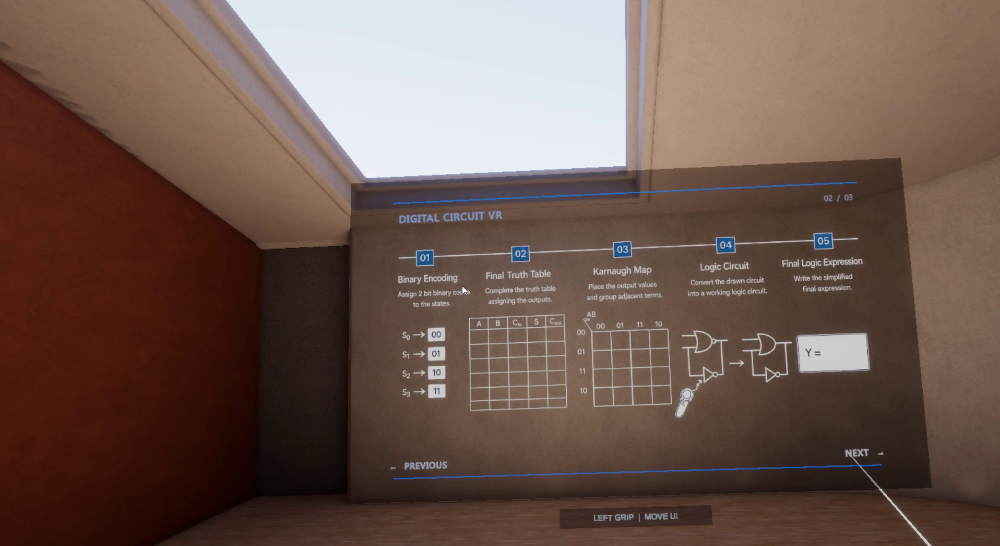

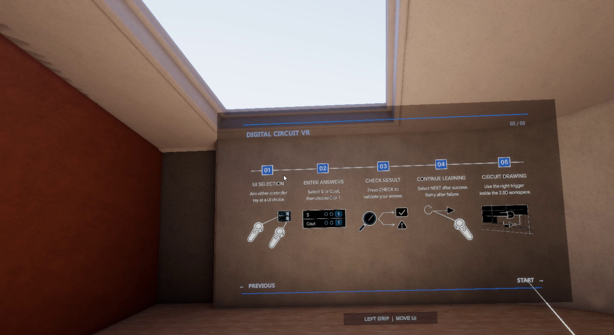

### 학습 문제

입력 `A`, `B`, `Cin`과 출력 `S`, `Cout`의 의미를 확인하고 `START`로 학습을 시작합니다.

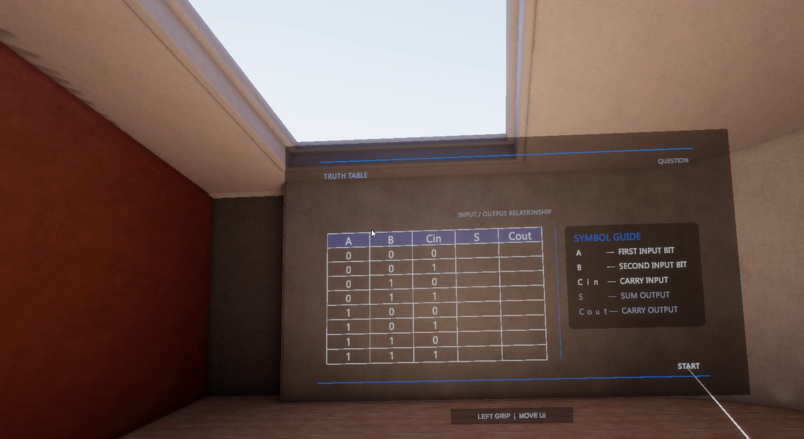

### 01. Binary Encoding — 이진수 입력

각 입력 조합에 맞는 `S`, `Cout` 값을 선택합니다. `CHECK ANSWER`로 정답을 확인하고 `RECORD TO TABLE`로 저장합니다. 8개 행을 모두 기록하면 최종 진리표가 표시됩니다.

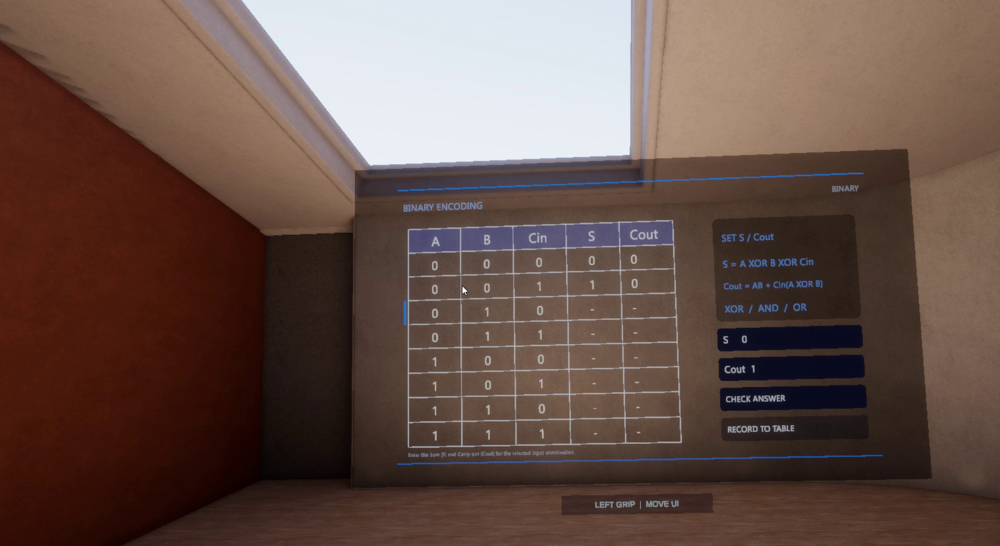

### 02. Final Truth Table — 최종 진리표

기록한 8개 입력 조합의 결과와 완료 요약을 확인합니다. `DETAIL VIEW`에서 전가산기의 입출력 관계를 살펴보고, `NEXT`로 카르노맵에 진입합니다.

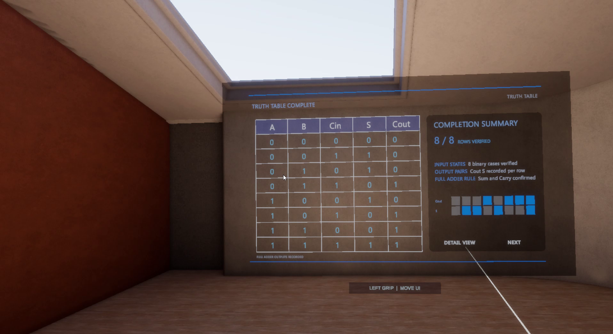

진리표 상세 설명 보기

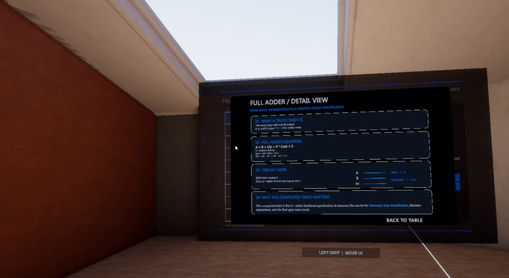

### 03. Karnaugh Map — 카르노맵

진리표의 `Cout S` 값을 Gray-code 순서 `00 → 01 → 11 → 10`에 맞게 배치합니다. 강조된 칸의 값을 `00`, `01`, `10`, `11` 중에서 선택하고 `CHECK MAP`으로 확인합니다.

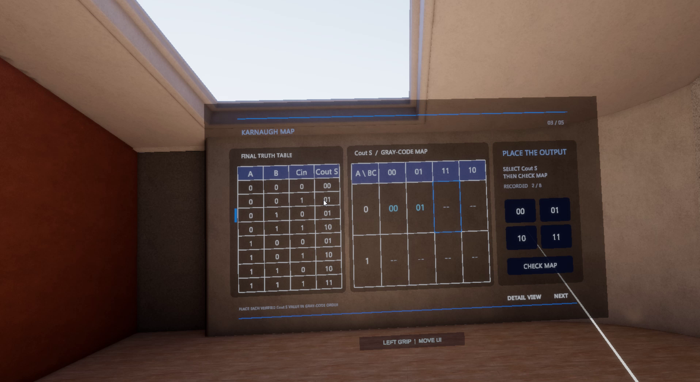

카르노맵 상세 설명과 완성 화면 보기

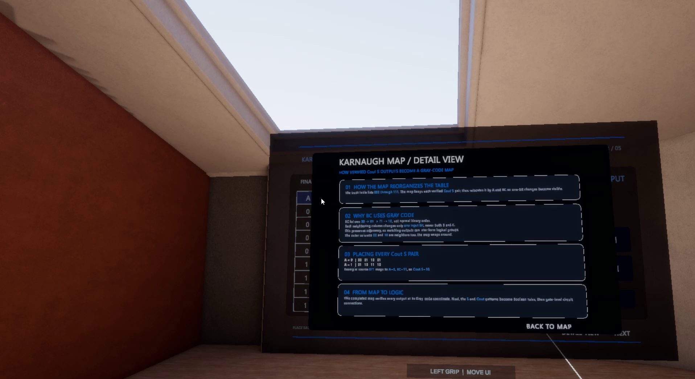

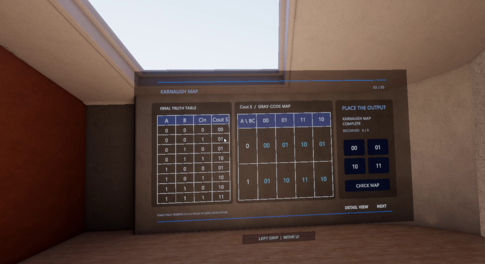

8개 칸을 완성한 뒤 `NEXT`로 논리회로 단계에 진입합니다.

### 04. Logic Circuit — 논리회로 작성

왼쪽의 진리표·카르노맵을 참고해 VR 캔버스에 전가산기를 구성합니다. 오른쪽 도구에서 `PEN`, `AND GATE`, `OR GATE`, `XOR GATE`를 선택해 게이트와 배선을 작성합니다.

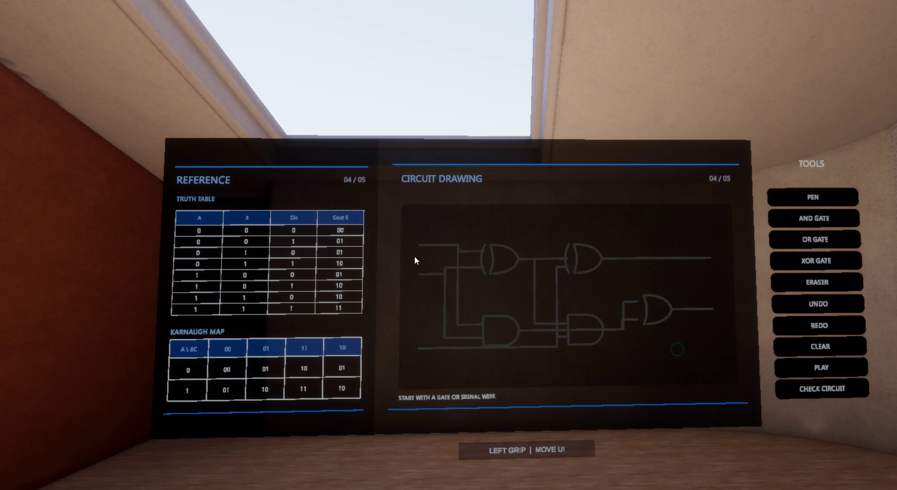

`ERASER`, `UNDO`, `REDO`, `CLEAR`로 수정하고 `PLAY`로 흐름 효과를 확인합니다. `CHECK CIRCUIT`로 게이트·배선 연결을 검증합니다.

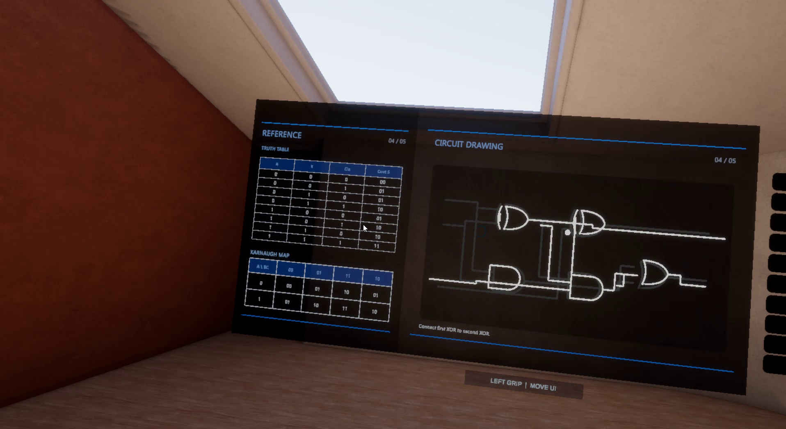

### 05. Final Logic Expression — 최종 논리식

진리표·카르노맵과 회로 다이어그램을 참고해 논리식을 작성합니다. `S` 또는 `Cout`을 선택하고 입력·연산자 토큰으로 식을 구성한 뒤 `CHECK S` 또는 `CHECK Cout`으로 확인합니다. `UNDO`와 `CLEAR`로 수정할 수 있습니다.

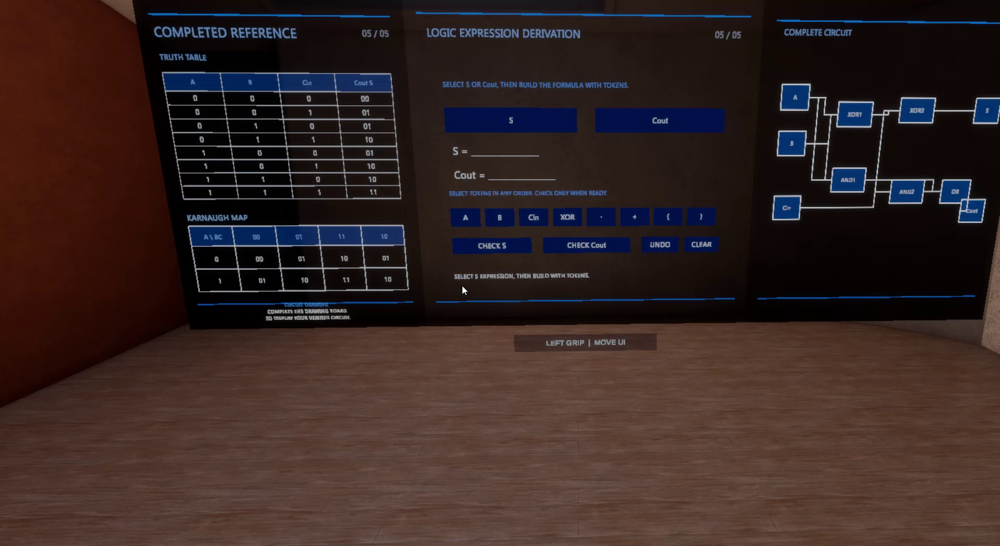

## 버전별 다운로드

| 버전 | 다운로드 | 주요 변경 |
| --- | --- | --- |
| ver4 | [Windows ZIP](Releases/Windows/ver4/DigitalVR2-Windows.zip) | 드로잉 인식·렌더링과 단계 전환 개선, 회로 전류 흐름 효과, UI 위치 조정 |
| ver3 | [Windows ZIP](Releases/Windows/ver3/DigitalVR2-Windows.zip) | 답안 가이드 스냅 동작과 스트로크·가이드 표시 개선 |
| ver2 | [Windows ZIP](Releases/Windows/ver2/DigitalVR2-Windows.zip) | 최종 단계 회로 다이어그램 추가, 격자 배선과 HMD UI 배치 정비 |
| ver1 | [Windows ZIP](Releases/Windows/ver1/DigitalVR2-Windows.zip) | 최초 Windows 테스트 빌드, 기본 학습 흐름과 이진 진리표 입력 |
