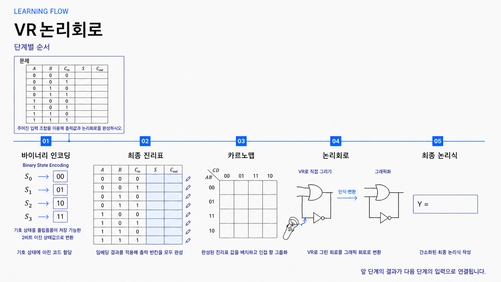

# Digital-VR

## 프로젝트 소개

- VR 환경 전가산기(Full Adder) 논리회로 단계별 학습 Unity 프로젝트
- 입력값 이진수 정리, 진리표·카르노맵 완성, VR 게이트·배선 직접 구성
- 그린 선 대신 인식된 포트와 연결 구조 기준 회로 검증

## 저장소 안내

이 저장소는 VR 전가산기 학습 앱의 Windows 실행 파일(ver1~ver4)과 사용 안내를 제공합니다. Unity 프로젝트와 C# 소스 코드는 포함하지 않습니다.

- 실행 파일: [Releases/Windows](Releases/Windows)
- 최신 버전: [ver4 다운로드](Releases/Windows/ver4/DigitalVR2-Windows.zip)
- 화면 이미지: README의 단계별 학습 가이드에서 확인

## 핵심 기능

- Introduction 안내 → 이진수 입력 → 최종 진리표 → 카르노맵 → VR 논리회로 → 최종 논리식 전체 학습 흐름
- 전가산기 입력 `A`, `B`, `Cin` 조합별 `Cout`, `S` 결과 정리와 진리표 완성
- 진리표 결과 기반 Gray-code 순서 카르노맵 구성과 8개 행 일치 확인
- XR 환경에서 AND, OR, XOR 게이트와 배선을 직접 그리는 VR 회로 작성
- `A`, `B`, `Cin` 입력과 `S`, `Cout` 출력 포트 기반 연결 구조 인식 및 `CircuitGraph` 변환
- 접점과 단순 교차 구분, 끊긴 배선·연결되지 않은 포트·미인식 게이트·불완전한 구조 오류 피드백
- XOR 2개, AND 2개, OR 1개 전가산기 표준 토폴로지 검증
- 검증 완료 회로와 카르노맵 결과 기반 최종 논리식 학습 연결

## 학습 워크플로우



Introduction: 학습 목표·진행 방식 안내

이후 5개 학습 단계 순차 진행

1. **Binary Encoding**: 문제 입력·출력 이진수 정리
2. **Final Truth Table**: 전가산기 입력 조합별 `Cout`, `S` 결과 완성
3. **Karnaugh Map**: 진리표 결과 카르노맵 배치와 논리 관계 확인
4. **Logic Circuit**: VR 게이트·배선 구성과 전가산기 회로 완성
5. **Final Logic Expression**: 검증 회로 기반 최종 논리식 확인

## 단계별 학습 가이드

### 01. Binary Encoding


- **학습 목표**: `A`, `B`, `Cin` 입력 조합별 `S`, `Cout` 출력 관계 정리
- **사용자 조작**: `S`, `Cout` 값 선택 → `Check` 확인 → `Record`로 행 저장
- **검증·완료**: 8개 입력 행 전체 기록; 정답 `CORRECT / NEXT ROW`, 오답 `INCORRECT / RECHECK S / Cout`

### 02. Final Truth Table


- **학습 목표**: 8개 `A`, `B`, `Cin` 조합과 `Cout`, `S` 결과 전체 확인
- **사용자 조작**: 이전 단계 기록 행 검토 → 설명 화면으로 논리 관계 확인
- **검증·완료**: 이진수 입력 단계에서 저장한 8개 결과 기반 진리표 완성; 카르노맵 단계 입력 기준 확보

### 03. Karnaugh Map


- **학습 목표**: 진리표 `Cout`, `S` 결과를 Gray-code 순서 카르노맵으로 재배치
- **사용자 조작**: 각 칸의 `Cout S` 값 `00`, `01`, `10`, `11` 선택 → `Check Map` 실행
- **검증·완료**: Gray-code 순서 8개 행 전체 일치; 진행 상태 `RECORDED 0 / 8`, 완료 `KARNAUGH MAP COMPLETE`

### 04. Logic Circuit


- **학습 목표**: 전가산기 논리 구조를 XR 환경의 게이트·배선으로 표현
- **사용자 조작**: AND, OR, XOR 게이트와 배선 작성; `A`, `B`, `Cin` 입력을 `S`, `Cout` 출력까지 연결
- **검증·완료**: 포트 연결·접점·교차 상태 확인; XOR 2개, AND 2개, OR 1개 전가산기 토폴로지 인식 후 최종 논리식 단계 연결

### 05. Final Logic Expression


- **학습 목표**: 완성 진리표·카르노맵·회로 구조를 `S`, `Cout` 논리식으로 정리
- **사용자 조작**: 대상 출력 `S` 또는 `Cout` 선택 → 토큰으로 식 구성 → `Check S` 또는 `Check Cout` 실행; `Undo`, `Clear` 사용 가능
- **검증·완료**: 8개 입력 조합 전체 의미 비교; 성공 `S EXPRESSION VERIFIED` 또는 `Cout EXPRESSION VERIFIED`, 실패 `NOT EQUIVALENT`

## 주요 화면 및 조작

| 화면 | 역할 | 주요 조작 |
| --- | --- | --- |
| Introduction 01-03 | 학습 목표와 전체 흐름 안내 | `NEXT`, `PREVIOUS`, `START`로 안내 화면 이동 및 학습 시작 |
| 문제·이진수 입력 | 전가산기 문제와 입력값 정리 | 단계별 입력 UI로 값 선택 및 다음 단계 이동 |
| 최종 진리표 | `A`, `B`, `Cin` 조합에 따른 `Cout`, `S` 결과 기록 | 각 행의 결과 입력 후 검토 |
| 카르노맵 | 진리표 결과를 Gray-code 순서로 재구성 | `00`, `01`, `10`, `11` 값 선택 후 `Check Map`으로 확인 |
| 논리회로 | VR 캔버스에서 게이트와 배선 작성 | 게이트·배선 그리기, 연결 구조 검증 |
| 최종 논리식 | 회로 학습 결과 정리 | 이전 단계에서 완성한 논리 관계 확인 |

## 검증 방식

- 선 모양이 아닌 인식 게이트 포트·배선 연결 구조 기반 `CircuitGraph` 검증
- 외부 입력 포트 `A`, `B`, `Cin`과 출력 포트 `S`, `Cout` 연결 확인
- AND, OR, XOR 게이트·배선 인식
- 접점 없는 교차: 비연결 교차 처리
- 끊긴 끝점·연결되지 않은 포트·미인식 게이트·불완전한 회로 구조: 오류 피드백 대상
- XOR 2개·AND 2개·OR 1개 전가산기 토폴로지 검증
- 진리표 `Cout`, `S` 값과 카르노맵 8개 행 전체 일치: 완료 조건

## Windows 실행 파일 및 릴리스

Windows 실행 파일 위치: [`Releases/Windows`](Releases/Windows)

| 버전 | 파일 | 상세 변경 |
| --- | --- | --- |
| ver1 | [`DigitalVR2-Windows.zip`](Releases/Windows/ver1/DigitalVR2-Windows.zip) | 최초 독립 실행형 Windows 테스트 빌드<br>기본 학습 흐름·UI 배치 기준선<br>이진 진리표 입력 흐름 포함 |
| ver2 | [`DigitalVR2-Windows.zip`](Releases/Windows/ver2/DigitalVR2-Windows.zip) | Stage 5 회로 다이어그램 전용 결과 화면 추가<br>격자 기반 배선 드로잉 흐름 정비<br>HMD 화면 UI 배치 보정 반영 |
| ver3 | [`DigitalVR2-Windows.zip`](Releases/Windows/ver3/DigitalVR2-Windows.zip) | 답안 가이드 스냅 릴리스 동작 추가<br>드로잉 스트로크 렌더링·가이드 표시 개선<br>회로 연결 작성 피드백 보강 |
| ver4 | [`DigitalVR2-Windows.zip`](Releases/Windows/ver4/DigitalVR2-Windows.zip) | 최신 Windows 빌드<br>드로잉 인식·렌더링 및 단계 전환 개선<br>회로 전류 흐름 효과·Stage 5 동적 회로 다이어그램 추가<br>워크플로우 UI 위치 조정 기능 반영 |

1. 원하는 ZIP 파일 다운로드·압축 해제
2. 압축 해제 폴더의 `DigitalVR2.exe` 실행
3. VR HMD·컨트롤러 연결 상태 확인

## 저장소 구조

```text
Releases/
└─ Windows/
   ├─ ver1/DigitalVR2-Windows.zip
   ├─ ver2/DigitalVR2-Windows.zip
   ├─ ver3/DigitalVR2-Windows.zip
   └─ ver4/DigitalVR2-Windows.zip
```

## 개선해야 할 점

- **UI 각도 안정화**: 사용자의 시선에 따라 UI 각도가 바뀌어 화면을 읽거나 조작할 때 불편함이 있습니다. 시선 이동 중에도 UI를 편하게 볼 수 있도록 각도 조정 방식을 개선할 필요가 있습니다.
- **회로 배선 그리기 정밀도**: 회로를 그릴 때 선이 의도한 경로대로 그려지지 않는 경우가 있어 게이트 사이의 배선을 구성하기 어렵습니다. 원하는 위치와 방향으로 선을 그릴 수 있도록 드로잉 정밀도를 개선할 필요가 있습니다.
- **전류 흐름 효과의 동작 완성도**: `PLAY` 버튼으로 전류 흐름을 표시하는 기능을 구현했지만, 배선이 정확하게 그려지지 않으면 흐름 효과도 원활하게 동작하지 않습니다. 배선 작성과 연결 인식의 정확도를 높이고, 이를 바탕으로 전류 흐름 효과를 보완할 필요가 있습니다.
